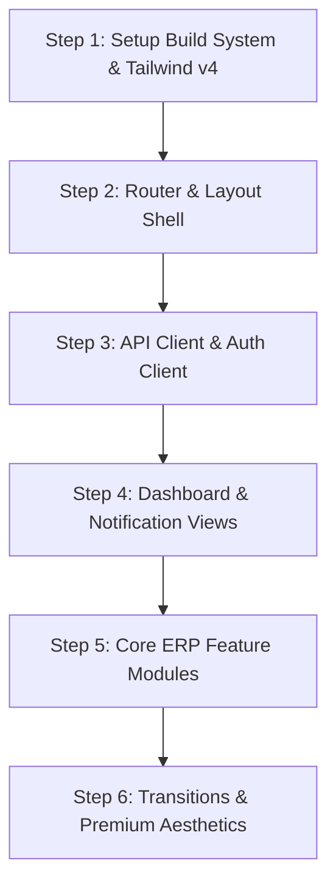

# Frontend Implementation Plan

Build a modern, high-performance, single-page web application (SPA) for the Enterprise Asset & Resource Management ERP. The UI will feature a premium, dark-mode/glassmorphic design system using Tailwind CSS v4, responsive layouts, and smooth micro-animations.

---

## Technical Stack & Configuration

1. **Framework**: Vanilla ES Modules (JS/HTML/CSS) combined with **Vite** for the build pipeline, hot-reloading dev server, and production bundling.
2. **Styling**: **Tailwind CSS v4** (using modern `@import "tailwindcss";` and `@config` syntax).
3. **Icons & Fonts**: Google Fonts (Outfit / Inter) and Lucide Icons (CDN/ESM).
4. **Backend Integration**: REST Client integrating with the FastAPI server running on `http://localhost:8000`. Handles Firebase token storage in localStorage/cookies.

---

## Folder Structure (`frontend/`)

```text
frontend/
  index.html            # SPA entry layout with main app container mount point
  package.json          # Node package manager config
  vite.config.js        # Vite bundling and dev-server configurations
  tailwind.config.js    # Tailwind theme extension configurations
  src/
    app.js              # SPA Router, state management, and bootloader
    style.css           # Tailwind CSS v4 imports, global resets, animations
    services/           # API integration clients
      api.js            # Axios/Fetch base client (attaches Auth headers)
      auth.js           # Firebase Auth wrapper / Token management
    components/         # Reusable UI elements
      sidebar.js        # Collapsible responsive sidebar navigation panel
      header.js         # Top navbar containing user profile and notifications dropdown
      toast.js          # Global visual warning/success message toasts
    views/              # Modular page views rendered dynamically by the router
      dashboard.js      # Analytics, quick counts, and charts
      assets.js         # Asset lists, search/filter, and creation
      allocations.js    # Allocations tracking, handovers, and return processing
      bookings.js       # Calendar-based shared resource bookings
      maintenance.js    # Maintenance logs, technicians, approvals
      audits.js         # Active audits, report lists, check submissions
      notifications.js  # Dedicated user inbox
      profile.js        # User profile, designation, and roles
```

---

## View Modules & Feature Scope

### 1. Dashboard View
- Grid cards displaying key metrics: Total Assets, Active Allocations, Pending Maintenance, Pending Bookings.
- Warning banner for overdue returns and pending approvals.

### 2. Assets & Categories View
- Search, categorization filter, and status filter.
- Responsive table & detail modals (hides financial fields like `purchaseCost` if user claims lack permission).
- Trigger deprecation calculating current value on-the-fly.

### 3. Allocations View
- Unified view of active, overdue, and returned allocations.
- "Allocate Asset" drawer with autocomplete search for assets and employees.
- "Return Asset" button updating condition snapshot.

### 4. Shared Resources & Bookings View
- Tabbed directory of resources.
- Responsive calendar scheduler showing daily/weekly booking slots.
- Real-time overlap warning checks before booking.

### 5. Maintenance Requests View
- Request creation form (Priority, description, asset selector).
- Detail dialog showing timeline logs and action buttons: Approve, Reject, Assign Technician, Start Work, Log Activity, Complete.

### 6. Audit Cycles View
- Progress tracker of active audits.
- Checklist form for audit verification (Asset validation, condition selection, discrepancy notes).

### 7. Inbox Notifications View
- List of unread/read messages with delete and mark-as-read buttons.

---

## Step-by-Step Implementation Workflow



### Step 1: Setup Build System & Tailwind v4
- Initialize `package.json` in `frontend/`.
- Configure `vite.config.js` to serve index.html.
- Set up Tailwind CSS v4 in `style.css`.
- Ensure standard local dev server starts on `http://localhost:5173`.

### Step 2: Router & Layout Shell
- Implement the SPA client-side router in `src/app.js` using HTML5 history API or hash-based routing.
- Create responsive Sidebar & Header layout templates (with smooth responsive toggling).

### Step 3: API Client & Auth Client
- Implement HTTP fetch client attaching `Authorization: Bearer <token>`.
- Mock auth sign-in for testing purposes or connect to firebase auth if set up.

### Step 4: Dashboard & Notification Views
- Create the main metric counts view.
- Create global toaster notification container.

### Step 5: Core ERP Feature Modules
- Build the Assets screen, Allocations screen, Calendar Bookings screen, Maintenance Timeline, and Audit check forms step-by-step.

### Step 6: Transitions & Premium Aesthetics
- Add fade/slide page transition animations.
- Apply glassmorphism headers (`backdrop-blur-md bg-white/70`).
- Add subtle hover animations on cards and interactive buttons.

---

## Verification Plan

### Manual Verification
- Start Vite Dev server (`npm run dev`) and connect in browser.
- Verify page routing without full-page reloads.
- Verify responsive layouts on desktop, tablet, and mobile views.
- Mock different user permission levels (Admin, Manager, Employee) and verify that restricted buttons/fields hide dynamically.
